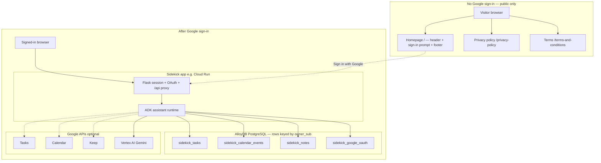
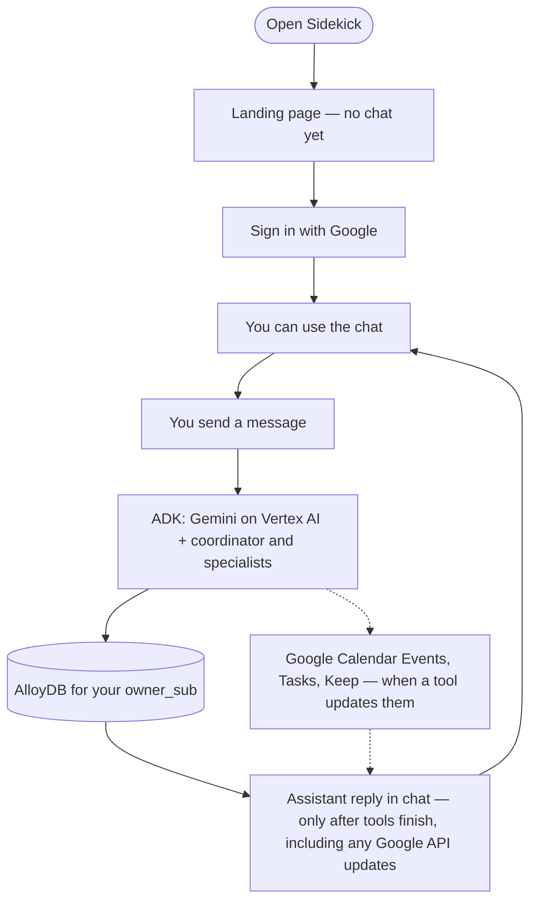
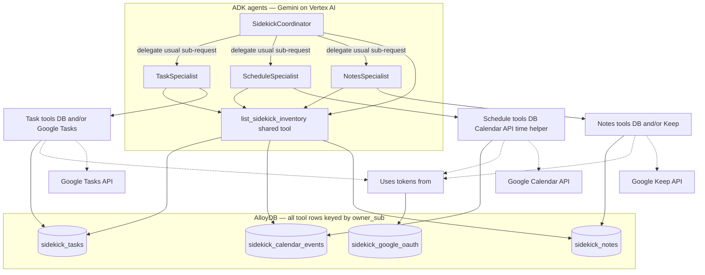
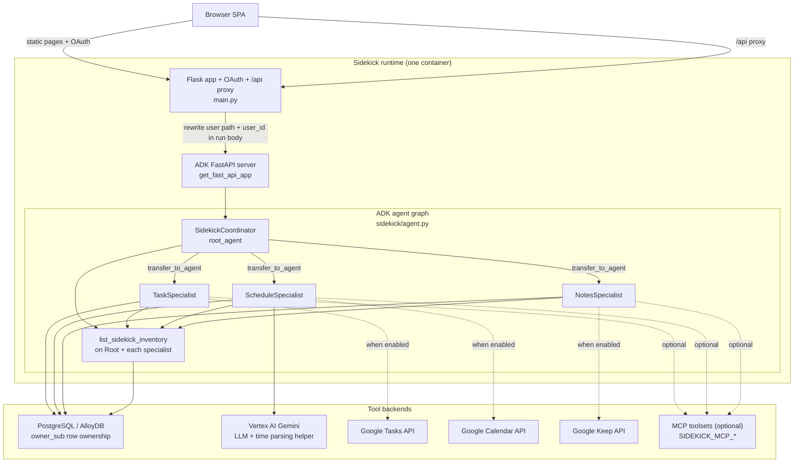
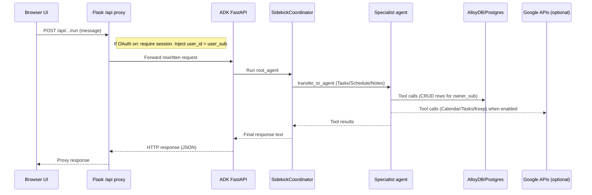
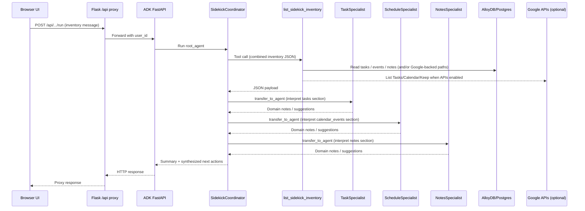

# Sidekick

Submission for **Hack2Skill Google GenAI APAC Cohort 1**.

Sidekick is a conversational assistant that helps you stay on top of **tasks**, **calendar-style plans**, and **notes** in one place. You chat in your browser; the assistant can organize information for you and, when you connect your Google account, work with familiar Google products while keeping a consistent backup in a database.

### Live app

The deployed instance is available at **[https://sidekick.amngupta.com](https://sidekick.amngupta.com)** (same host as the default `SIDEKICK_RESOURCE_LABEL` in this repo). If you move hosting, update this link in the README.

---

## Google Cloud and Google products used

| Area | What we use |
|------|----------------|
| **Compute** | **[Cloud Run](https://cloud.google.com/run)** — runs the container (Flask UI + ADK); `K_SERVICE` / `TRUST_PROXY_HEADERS` in `.env.example` match Cloud Run’s HTTPS proxy behavior. |
| **Database** | **[AlloyDB for PostgreSQL](https://cloud.google.com/alloydb)** — Google's managed **PostgreSQL**-compatible database; primary datastore via `DATABASE_URL` or the **[AlloyDB Auth Proxy / Connector](https://cloud.google.com/alloydb/docs/connect-connectors)** (`ALLOYDB_*` in `.env.example`). All application tables live in this database (see diagram below). |
| **AI / ML** | **[Vertex AI](https://cloud.google.com/vertex-ai)** with **Gemini** (`GOOGLE_GENAI_USE_VERTEXAI`, `GOOGLE_CLOUD_PROJECT`, `GOOGLE_CLOUD_LOCATION`) for the ADK agents and for natural-language → UTC time parsing in schedule tools. |
| **Agents** | **[Google Agent Development Kit (ADK)](https://google.github.io/adk-docs/)** — multi-agent orchestration (`LlmAgent`, tools, MCP). |
| **Models** | **[Gemini 2.5 Flash](https://ai.google.dev/gemini-api/docs/models/gemini-2.5-flash)** — 2.5 Flash is best for large scale processing, low-latency, high volume tasks that require thinking, and agentic use cases. |
| **Identity & APIs** | **Google OAuth 2.0 / OpenID Connect** — sign-in and offline refresh tokens stored per user. Optional product APIs: **[Calendar](https://developers.google.com/calendar)**, **[Tasks](https://developers.google.com/tasks)**, **[Keep](https://developers.google.com/workspace/keep/api)** (via `google-api-python-client`). |
| **Observability** | ADK can send **trace** / **OpenTelemetry** data to Google Cloud when `ADK_TRACE_TO_CLOUD` / `ADK_OTEL_TO_CLOUD` are enabled. |

Locally or on other hosts you can still use **any PostgreSQL** (not only AlloyDB) via `DATABASE_URL`, or call Gemini with **`GOOGLE_API_KEY`** instead of Vertex when not using `GOOGLE_GENAI_USE_VERTEXAI`.

---

## In plain language

### What you can do

- **Tasks** — Add or list things to do. With Google Tasks enabled, items can appear in your Google Tasks list; the app can also keep its own copy for reference.
- **Schedule** — Describe meetings or blocks of time in everyday words (“tomorrow at 3pm for an hour”). The assistant turns that into precise times and can create calendar entries when Google Calendar is connected.
- **Notes** — Capture short notes or reference text. With Google Keep enabled, notes can live in Keep as well as in the app’s records.

### How it knows it’s you

With **OAuth configured** (the intended production setup), you **must** complete **Sign in with Google** before the chat UI or `/api` agent calls work. Flask ties your session to your Google account; the proxy injects your **`sub`** into ADK so tools read and write rows scoped by **`owner_sub`** in AlloyDB. **The chat does not show which Google user “owns” each task in the UI**—that separation is enforced in the database and API, not as labels inside the conversation.

If OAuth client env vars are **omitted** (developer “open” mode), the SPA treats you as signed-in and the server does not gate `/api`; that is not how the deployed app behaves.

### What “Sidekick” leaves behind in Google

Items the assistant creates are tagged with a small **label** (configurable) so you can search for them in Google and so “show me everything from Sidekick” stays accurate. See `SIDEKICK_RESOURCE_LABEL` in `.env.example` for operators.

---

## Diagrams

### Big picture (what talks to what)

**Production (OAuth on):** visitors without a Google session only use **static, public pages** from Flask. The **assistant, AlloyDB-backed tools, and `/api`** run only **after** sign-in.

- **Public** block: no chat form, no agent, no AlloyDB access from the browser—only **homepage shell**, **Privacy**, and **Terms** (plus theme toggle and links). `/login/google` starts OAuth; it does not by itself expose the assistant.
- **Authenticated** block: same runtime as before—**`owner_sub`** scopes data per user server-side; the UI does not print user ids on individual tasks.
- **Dashed** edges to **Tasks / Calendar / Keep**: product APIs when enabled and consented. **Vertex AI**: model + schedule parsing when configured (`.env.example`).

Solid lines are core architecture for signed-in use. Dashed lines are optional Google product APIs or the transition from landing page to signed-in app.

### Your journey as a user

**Production:** the landing page has **no chat** until you **Sign in with Google**; after that you can talk to the assistant.

Sidekick can reach **Google** in three ways: **OAuth 2.0 / OpenID Connect** (sign-in, refresh tokens, and user profile), the **Google Calendar API** (for Google Calendar events), the **Google Tasks API** (for Google Tasks), the **Google Keep API** (for Google Keep), and **Vertex AI** for **Gemini** (orchestrating agents and natural-language time parsing).

- **Landing:** no composer until you are signed in (see the **Public** block in the big-picture diagram).
- **Each turn:** specialists may write to **AlloyDB** and, when integrations are on, call **Calendar / Tasks / Keep**; the next message appears **after** those tool calls complete. The chat UI does **not** show user ids on each item.
- **Full inventory:** a single user message can trigger **`list_sidekick_inventory`** plus **three** specialist interpretation passes (tasks, then calendar, then notes) before the final reply—see the inventory sequence diagram below.

### How the assistant is organized (conceptual)

Agents run **after** sign-in; tools use **`owner_sub`** for AlloyDB. **Google product APIs** are optional (dashed). **Gemini on Vertex AI** powers the LLM agents.

The **coordinator** usually routes to **one specialist** per sub-request. For a **full Sidekick inventory** (list everything across tasks, calendar, and notes), it calls **`list_sidekick_inventory`**, summarizes, then **transfers in order** to **TaskSpecialist → ScheduleSpecialist → NotesSpecialist** so each domain interprets its slice and the coordinator synthesizes next actions (suggestions only unless the user asked to change data). **Specialists also have `list_sidekick_inventory`** when they need cross-domain context on other turns. Specialists call **database tools** and, when OAuth scopes and APIs allow, **Google** tools; **`sidekick_google_oauth`** holds refresh tokens for those calls.

### ADK agent architecture (as implemented)

This is the “wiring diagram” of what actually runs in this repo: `main.py` starts an internal ADK FastAPI server, the Flask app proxies `/api/*` to it, injects the signed-in user’s `sub` as ADK `user_id`, and the ADK root agent (`SidekickCoordinator`) delegates with **`transfer_to_agent`**—usually **one specialist** per sub-request, except for a **full inventory** turn where Root runs **`list_sidekick_inventory`** then chains **Task → Schedule → Notes** before synthesizing.

**Full inventory flow:** Root calls **`list_sidekick_inventory`** (reads tasks, calendar events, and notes from DB and/or Google APIs), then **`transfer_to_agent`** in order: **Task → Schedule → Notes** for domain interpretation, then Root synthesizes. On other turns, Root typically transfers to **one** specialist; any specialist may call **`list_sidekick_inventory`** for cross-domain context.

### ADK request flow (one chat turn)

### ADK flow: full Sidekick inventory + specialist interpretation

When the user asks to list everything Sidekick-tagged across tasks, calendar, and notes, the coordinator calls **`list_sidekick_inventory`** once, then transfers to each specialist in order so they interpret their slice (recommendations only unless the user asked for changes); the coordinator then synthesizes.

---

## For developers

- **Run locally:** configure environment from `.env.example`, install dependencies (e.g. `uv sync`), run `python main.py`.
- **OAuth vs UI:** When `GOOGLE_OAUTH_CLIENT_ID` / `SECRET` are set, `static/index.html` hides the chat until `/auth/me` shows a signed-in user and returns **401** on `/api` without a session—matching the public-vs-authenticated diagram above. Omit those vars only for local open testing.
- **Code map:** `main.py` serves the UI and proxies the agent API; `sidekick/agent.py` defines the multi-agent graph; `sidekick/db.py` handles the database; Google integrations live in `sidekick/google_*` modules.

Python modules include **module and function docstrings** describing behavior and configuration hooks.

## Legal and policy pages

**Privacy Policy** and **Terms of Service** are always reachable without signing in (`/privacy-policy`, `/terms-and-conditions`). On the **homepage** (`/`), visitors without a session still see the header and footer (including those links) but **not** the chat composer—that stays behind the login wall until Google sign-in completes (`static/index.html`).
